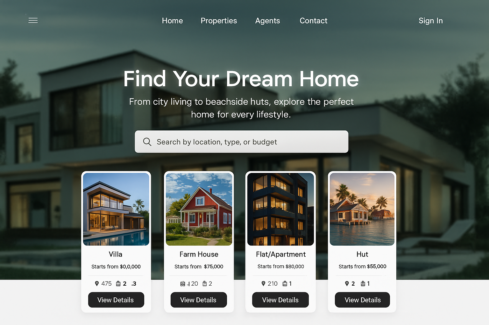

# Real Estate Rental Platform (crypto payment system)

Rental Platform aims to revolutionize the rental property market by integrating cryptocurrency payments into a secure, scalable platform that simplifies transactions for property owners and tenants.



### Support a multi-currency crypto payment system.

A secure crypto payment system that allows users to pay rent or make deposits using cryptocurrencies.


### 🔥 Web3 is not a temporary trend - it is the future of the Internet!

#### 🚀 Are you ready to enter the Web3 Era? Let's explore a decentralized world today!


## Prerequisites

Before getting started, make sure you have the following installed:

-Node.js
-npm

## Getting Started

Follow these steps to set up the project:

1. Clone the repository:

   ```bash
   git clone https://github.com/EstateX/property-rental.git
   ```

2. Navigate to the project directory:

   ```bash
   cd property-rental
   ```

3. Install the dependencies:

   ```bash
   npm install
   ```

4. Start the development server:

   ```bash
   npm run start
   ```

   The application will now be running on `http://localhost:3000`.